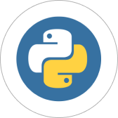

# **Алексей Аксютин**
### **Fullstack-разработчик**
*Email*: *all-lex-aks@mail.ru*

*Telegram*: *@all-lex-aks*

### 

## Ключевые навыки
- Вёрстка сайтов в HTML и CSS
- Frontend-разработка на JavaScript и React
- Работа с изменениями кода проекта с помощью Git и GitHub
- Решение универсальных задач с использованием Python
- Разработка сайтов с помощью фреймворка Django
- Применение принципов клиент-серверного взаимодействия
- Работа с базами данных с использованием SQLAlchemy и PostgreSQL
- Работа с API сторонних сервисов
- Unit-тестирование при помощи PyTest и Jest

## Инструменты

- **Python**
- **Django**
- **JavaScript**
- **React**
- **HTML**
- **CSS**
- **VirtualDOM**
- **Git**
- **SQLAlchemy**
- **PostgreSQL**
- **XML/JSON/YAML/CSV**
- **API**
